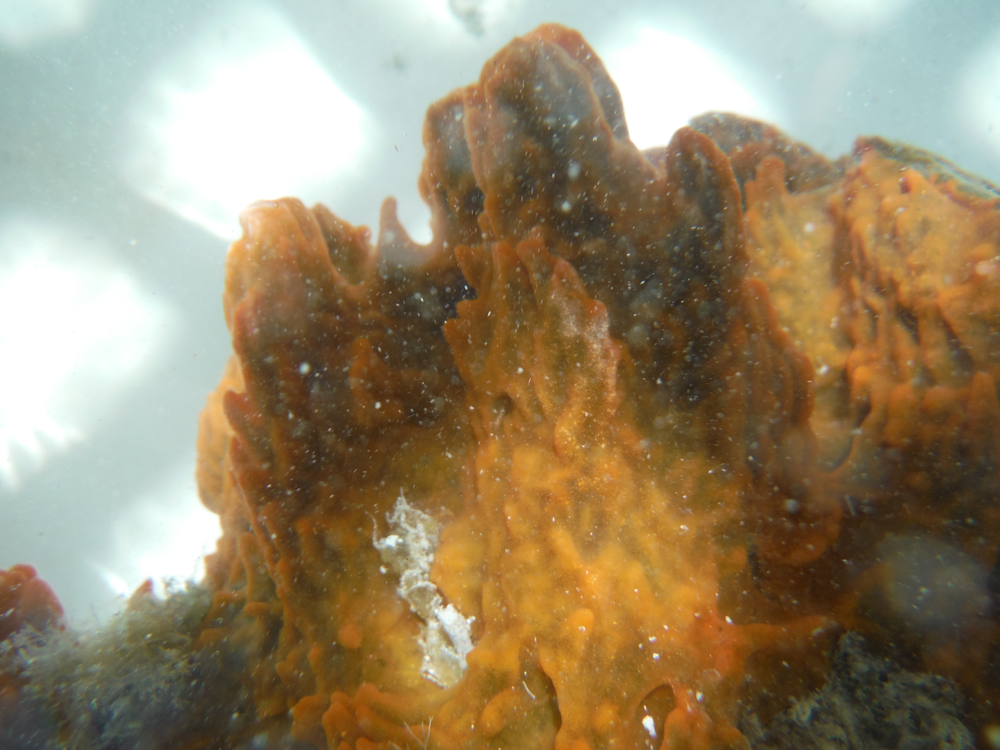
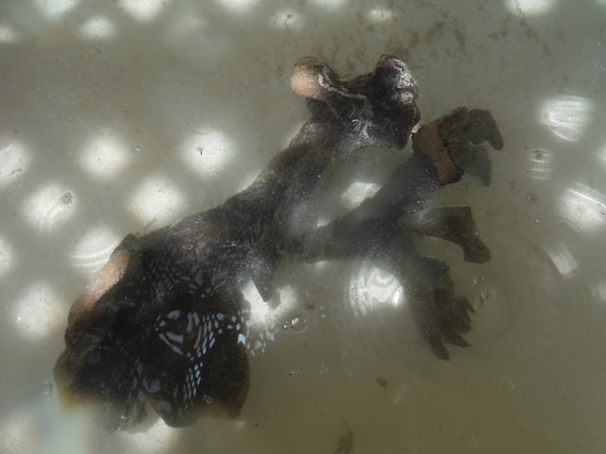
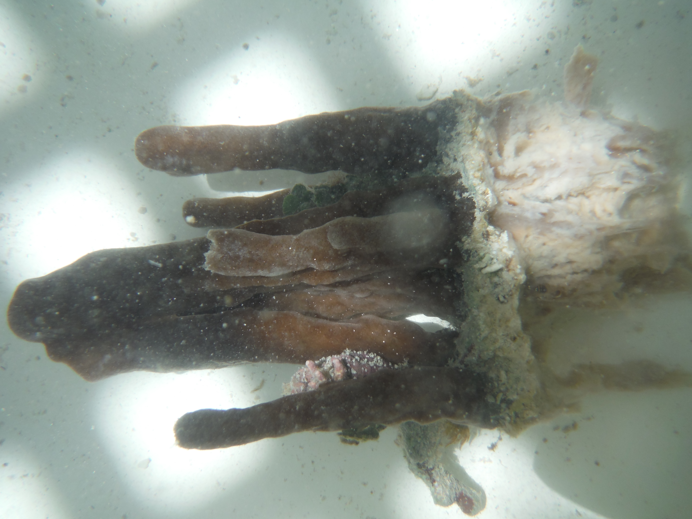

# :whale2::tropical_fish::octopus: Marine Drugs Paper :shell::fish::whale::dolphin:

Repository to host analyses for the Marine Drugs Paper (Due Jan. 31st, 2021)









To run jupyter notebook first install the conda env `sh install.sh`.

Activate the conda env: `conda activate sponges` and you're ready to go through the analyses.


```shell
# Install dependencies
sh install.sh

# Activate env
conda activate sponges

# Example usage:
jupyter notebook notebooks/otu_embeddings.ipynb
```
