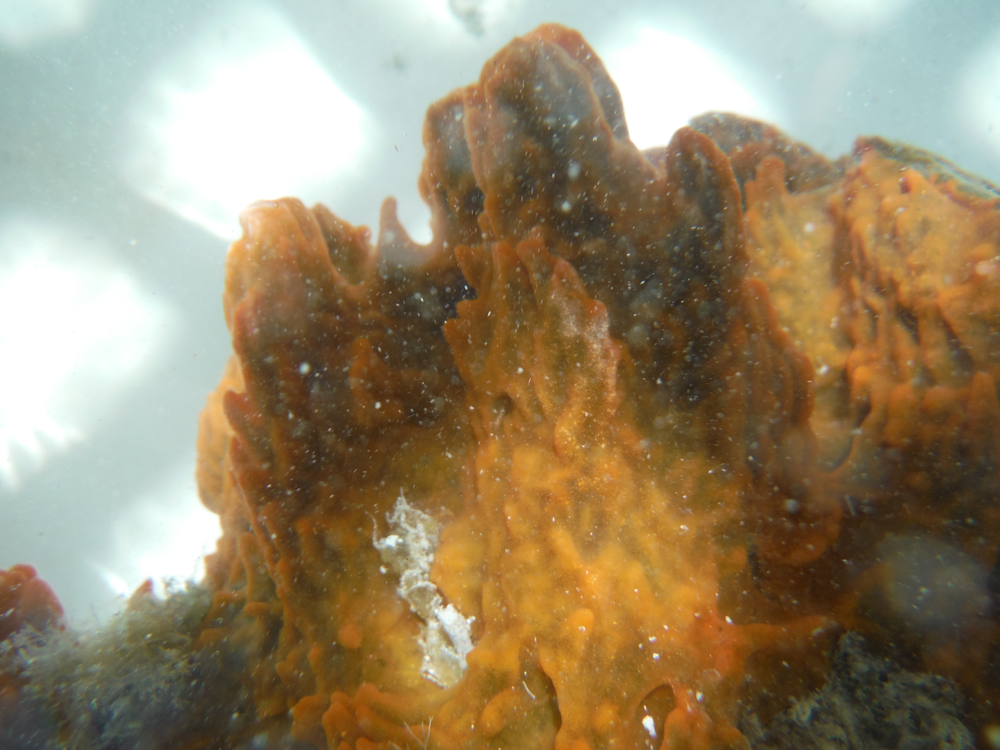
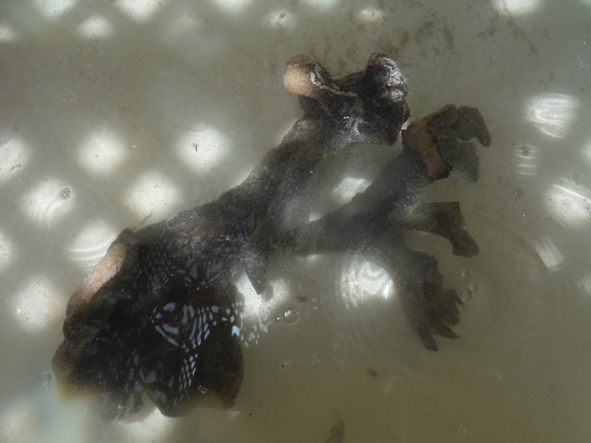
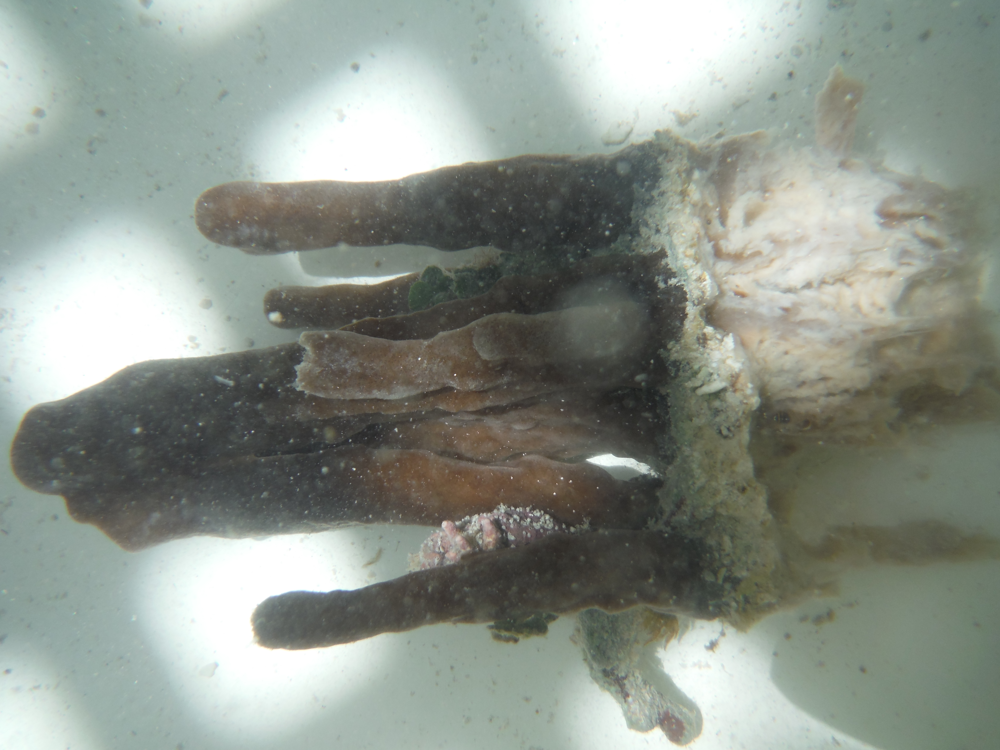

# :whale2::tropical_fish::octopus: Sponge Paper :shell::fish::whale::dolphin:

Repository to host analyses for the Sponge Paper

## Overview of Sponges and their associated data

Contents of: `marine_drugs/data/raw/sponge_metadata.tsv`

| Sponge specimen | Taxonomic Classification                       | Activity    | Shotgun | Metatranscriptome |
| --------------- | ---------------------------------------------- | ----------- | ------- | ----------------- |
| FL2014-3        | Hippospongia lachne                            | Antibiofilm | Yes     | Yes               |
| FL2014-5        | Hippospongia lachne                            | Antibiofilm | No      | No                |
| FL2014-6        | Hippospongia lachne                            | Antibiofilm | No      | No                |
| FL2014-8        | Hippospongia lachne                            | Antibiofilm | No      | No                |
| FL2014-9        | Hippospongia lachne                            | None        | Yes     | Yes               |
| FL2015-42       | Tedania ignis                                  | None        | Yes     | Yes               |
| FL2015-45       | Tedania ignis                                  | None        | No      | No                |
| FL2015-47       | Tedania ignis                                  | None        | No      | No                |
| FL2015-43       | Tedania ignis                                  | Antibiofilm | Yes     | Yes               |
| FL2015-2        | Ircinia felix                                  | None        | No      | No                |
| FL2015-9        | Ircinia felix                                  | Antibiotic  | Yes     | Yes               |
| FL2015-20       | Ircinia felix                                  | None        | No      | No                |
| FL2015-27       | Ircinia felix                                  | Antibiotic  | No      | No                |
| FL2015-30       | Ircinia felix                                  | Antibiofilm | Yes     | No                |
| FL2015-34       | Ircinia felix                                  | None        | Yes     | Yes               |
| FL2015-36       | Ircinia felix                                  | Antibiofilm | No      | No                |
| FL2015-38       | Ircinia felix                                  | Antibiotic  | No      | No                |
| FL2015-4        | Spheciospongia vesparium                       | None        | Yes     | Yes               |
| FL2015-5        | Spheciospongia vesparium                       | Antibiofilm | Yes     | Yes               |
| FL2015-31       | Spheciospongia vesparium                       | Antibiotic  | No      | No                |
| FL2015-32       | Spheciospongia vesparium                       | None        | No      | No                |
| FL2015-33       | Spheciospongia vesparium                       | None        | No      | No                |
| FL2015-39       | Spheciospongia vesparium                       | None        | No      | No                |
| FL2015-46       | Spheciospongia vesparium                       | Antibiofilm | No      | No                |
| FL2015-44       | Neopetrosia proxima / Spheciospongia vesparium | Antibiofilm | Yes     | Yes               |
| FL2015-37       | Neopetrosia proxima / Spheciospongia vesparium | None        | Yes     | Yes               |
| FL2015-8        | Ircinia felix (determined w/mtDNA)             | None        | Yes     | No                |

___

## Repository structure

To run jupyter notebook first install the conda env (`make env`).

Activate the conda env: `conda activate sponges` and you're ready to go through the analyses.

```shell
# Install dependencies
make env

# Activate env
conda activate sponges

# Example usage:
jupyter notebook marine_drugs/notebooks/otu_embeddings.ipynb
```

I've reformatted the directory structure following the [Cookiecutter Data Science](http://drivendata.github.io/cookiecutter-data-science/#cookiecutter-data-science "Cookiecutter Data Science Site") repo.

*Hopefully* this will help to organize our analyses and more easily follow/reproduce any preprocessing or figures that will be needed for the paper.

As mentioned in the [notebooks section](http://drivendata.github.io/cookiecutter-data-science/#notebooks-are-for-exploration-and-communication) I'm going to follow the notebook naming convention: `<step>-<ghuser>-<description>.ipynb`

## Some of the sponges with which we are working :neckbeard:

### FL2015-43 *Tedania ignis*



### FL2015-9 *Ircinia felix*



### FL2015-44 _Neopetrosia proxima_ or _Spheciospongia versparium_

