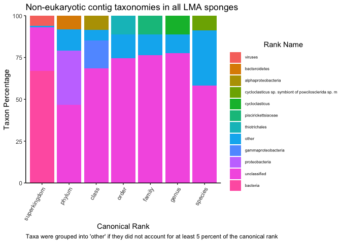
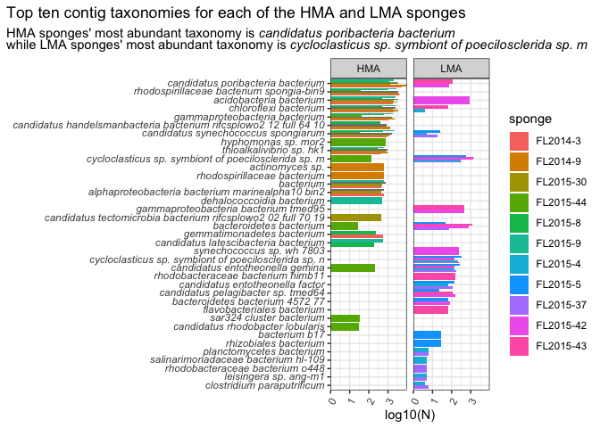
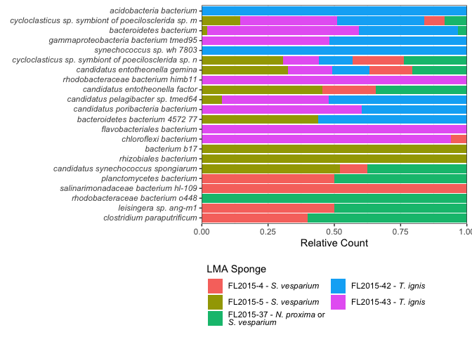
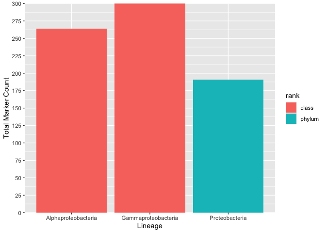
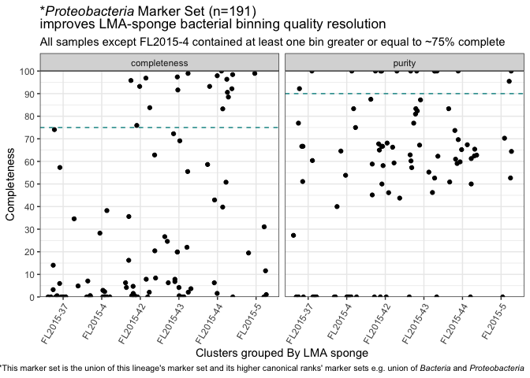
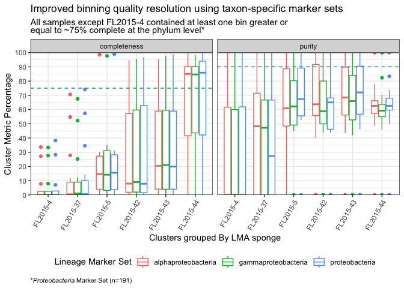

LMA sponge taxon-specific marker set annotation
================

## LMA sponges contig taxonomy stacked bar plot

``` r
taxa <- read_tsv(here("sponge_paper/data/processed/LMA-marker-annotation/lma_sponges_contig_taxonomy.tsv"))
```

    ## 
    ## ── Column specification ────────────────────────────────────────────────────────
    ## cols(
    ##   contig = col_character(),
    ##   taxid = col_double(),
    ##   superkingdom = col_character(),
    ##   phylum = col_character(),
    ##   class = col_character(),
    ##   order = col_character(),
    ##   family = col_character(),
    ##   genus = col_character(),
    ##   species = col_character(),
    ##   sponge = col_character()
    ## )

``` r
tidy_taxa <- taxa %>% 
  # filter(phylum == "proteobacteria") %>%
  filter(superkingdom != "eukaryota") %>%
  # filter(superkingdom == "bacteria") %>%
  pivot_longer(cols=c(superkingdom, phylum, class, order, family, genus, species),
               names_to="canonical_rank", values_to="rank_name") %>% 
  group_by(canonical_rank, rank_name) %>% 
  summarize(rank_name_count = n(),
            .groups = "keep")

crank_sums <- tidy_taxa %>% 
  group_by(canonical_rank) %>% 
  summarize(canonical_rank_sum = sum(rank_name_count), .groups="keep") %>% 
  left_join(tidy_taxa, ., by='canonical_rank')

rank_freqs <- crank_sums %>% 
  group_by(canonical_rank, rank_name, rank_name_count) %>% 
  summarize(rank_name_percentage = (rank_name_count / canonical_rank_sum) * 100,
            .groups="keep") %>% 
  mutate(rank_name=if_else(rank_name_percentage > 5.0, rank_name, "other")) %>% 
  group_by(canonical_rank, rank_name) %>% 
  summarize(rank_name_percentage_sum = sum(rank_name_percentage), .groups="keep")


p <- rank_freqs %>% 
  ggplot(aes(x=canonical_rank, y=rank_name_percentage_sum, fill=reorder(rank_name, rank_name_percentage_sum)))+
  geom_col()+
  scale_x_discrete(limits=c("superkingdom", "phylum", "class", "order", "family", "genus", "species"))+
  # scale_x_discrete(limits=c("class", "order", "family", "genus", "species"))+
  # scale_x_discrete(limits=c("phylum", "class", "order", "family", "genus", "species"))+
  scale_fill_discrete(name="Rank Name")+
  scale_y_continuous(expand=c(0, NA))+
  # facet_wrap(~sponge)+
  labs(x="Canonical Rank",
       y="Taxon Percentage",
       title="Non-eukaryotic contig taxonomies in all LMA sponges",
       caption = "Taxa were grouped into 'other' if they did not account for at least 5 percent of the canonical rank")+
  theme_classic()+
  theme(axis.title.y = element_markdown(),
        axis.text.x = element_markdown(angle=60, hjust=1),
        legend.text = element_markdown(size=6),
        legend.margin = margin(c(t=50, r=0, b=0, l=2)),
        legend.title = element_text(hjust=0.5),
        # plot.subtitle = element_markdown(hjust=1),
        plot.caption = element_markdown(hjust=0))


ggsave("05-WiscEvan-LMA-sponge-taxon-specific-marker-set-annotation_files/lma_sponges_contig_taxonomy_stacked_bar_plot.pdf", p)
```

    ## Saving 7 x 5 in image

``` r
p
```

<!-- -->

``` r
# NOTE: Could we pivot superkingdom longer to facet wrap each kingdom to get the percentages? This would need to be performed earlier so percentages would be correct.
```

## Get top ten taxa grouped by sponge type and sponge

Note, we also first filter for only bacterial contigs and remove any
unclassified
contigs

``` r
taxa <- read_tsv(here("sponge_paper/data/processed/LMA-marker-annotation/all_sponges_contig_taxonomy_with_sponge_type.tsv")) %>% 
  filter(superkingdom == "bacteria") %>% 
  filter(species != "unclassified") %>% 
  mutate(sponge=factor(sponge),
         sponge_type=factor(sponge_type))
```

    ## 
    ## ── Column specification ────────────────────────────────────────────────────────
    ## cols(
    ##   contig = col_character(),
    ##   taxid = col_double(),
    ##   superkingdom = col_character(),
    ##   phylum = col_character(),
    ##   class = col_character(),
    ##   order = col_character(),
    ##   family = col_character(),
    ##   genus = col_character(),
    ##   species = col_character(),
    ##   sponge = col_character(),
    ##   sponge_type = col_character()
    ## )

``` r
tidytax <-taxa %>% 
  group_by(sponge_type, sponge, species) %>% 
  summarize(contig_count=n(), .groups="keep") %>% 
  group_by(sponge_type, sponge) %>% 
  arrange(desc(contig_count), .by_group=TRUE) %>% 
  top_n(10) %>% 
  mutate(species=str_replace_all(species, "_", " "),
         species=str_glue("*{species}*"),
         sponge=str_replace(sponge, "_", "-"))
```

    ## Selecting by contig_count

``` r
tidytax %>% 
  ggplot(aes(x=reorder(species, contig_count), y=log10(contig_count), fill=sponge)) +
  geom_col(position='dodge') + 
  scale_fill_discrete(limits=c("FL2014-3",
                               "FL2014-9",
                               "FL2015-30",
                               "FL2015-44",
                               "FL2015-8",
                               "FL2015-9",
                               "FL2015-4",
                               "FL2015-5",
                               "FL2015-37",
                               "FL2015-42",
                               "FL2015-43"))+
  scale_y_continuous(expand=c(0,NA))+
  facet_wrap(~sponge_type) + 
  coord_flip()+
  theme_bw()+
  labs(title="Top ten contig taxonomies for each of the HMA and LMA sponges",
       subtitle = "HMA sponges' most abundant taxonomy is *candidatus poribacteria bacterium*<br>while LMA sponges' most abundant taxonomy is *cycloclasticus sp. symbiont of poecilosclerida sp. m*",
       x=element_blank(),
       y="log10(N)")+
  theme(axis.text.y = element_markdown(),
        axis.text.x = element_text(angle=60, hjust=1),
        plot.subtitle = element_markdown(),
        plot.title.position = "plot",
        legend.text = element_markdown())
```

<!-- -->

``` r
taxa <- read_tsv(here("sponge_paper/data/processed/LMA-marker-annotation/all_sponges_contig_taxonomy_with_sponge_type.tsv")) %>% 
  filter(superkingdom == "bacteria",
         species != "unclassified") %>% 
  mutate(sponge=factor(sponge),
         sponge_type=factor(sponge_type))
```

    ## 
    ## ── Column specification ────────────────────────────────────────────────────────
    ## cols(
    ##   contig = col_character(),
    ##   taxid = col_double(),
    ##   superkingdom = col_character(),
    ##   phylum = col_character(),
    ##   class = col_character(),
    ##   order = col_character(),
    ##   family = col_character(),
    ##   genus = col_character(),
    ##   species = col_character(),
    ##   sponge = col_character(),
    ##   sponge_type = col_character()
    ## )

``` r
tidytax <-taxa %>% 
  group_by(sponge_type, sponge, species) %>% 
  summarize(contig_count=n(), .groups="keep") %>% 
  group_by(sponge_type, sponge) %>% 
  arrange(desc(contig_count), .by_group=TRUE) %>% 
  top_n(10) %>% 
  mutate(species=str_replace_all(species, "_", " "),
         species=str_glue("*{species}*"),
         sponge=str_replace(sponge, "_", "-"))
```

    ## Selecting by contig_count

``` r
sponge_names <- read_tsv(here("sponge_paper/data/raw/sponge_metadata.tsv")) %>% 
  mutate(taxon=if_else(str_detect(`Taxonomic Classification`, "/"),
                       # Neopetrosia proxima / Spheciospongia vesparium
                       str_replace(`Taxonomic Classification`,
                                   "(.{1}?).*\\s(.*?)\\s/\\s(.{1}?).*\\s(.*)",
                                   "*\\1. \\2* or<br>*\\3. \\4*"),
                       str_replace(`Taxonomic Classification`,
                                   "(.{1}?).*\\s(.*)",
                                   "*\\1. \\2*")),
         # Ircinia felix (determined w/mtDNA)
         taxon=if_else(str_detect(taxon, "determined"),
                       str_replace(taxon,
                                   "(.{1}?).*\\s(.*)\\s(.*)\\s(.*)",
                                   "*\\1. \\2* <br>\\3 \\4"),
                       taxon)) %>% 
  select(`Sponge specimen`, taxon, Activity)
```

    ## 
    ## ── Column specification ────────────────────────────────────────────────────────
    ## cols(
    ##   `Sponge specimen` = col_character(),
    ##   `Taxonomic Classification` = col_character(),
    ##   Activity = col_character(),
    ##   Shotgun = col_character(),
    ##   Metatranscriptome = col_character()
    ## )

``` r
tidytax_names <- left_join(tidytax, sponge_names, by=c("sponge" = "Sponge specimen")) %>% 
  mutate(sponge=str_glue("{sponge} - {taxon}"))

hma <- tidytax_names %>% 
  filter(sponge_type == "HMA") %>% 
  ggplot(aes(x=reorder(species, contig_count), y=contig_count, fill=sponge)) +
  geom_col(position='fill') + 
  scale_y_continuous(expand=c(0,NA))+
  scale_fill_discrete(name="HMA Sponge",
                      guide=(guide_legend(ncol=4, nrow = 2, title.position = "top")))+
  coord_flip()+
  theme_bw()+
  labs(x=element_blank(),
       y="Relative count")+
  theme(axis.text.y = element_markdown(),
        axis.text.x = element_text(),
        plot.subtitle = element_markdown(),
        plot.title.position = "plot",
        legend.text = element_markdown(),
        legend.position = "bottom")

hma
```

<!-- -->

``` r
tidytax_names %>% 
  filter(sponge_type == "LMA") %>% select(sponge) %>% distinct()
```

    ## Adding missing grouping variables: `sponge_type`

    ## # A tibble: 5 x 2
    ## # Groups:   sponge_type, sponge [5]
    ##   sponge_type sponge                                       
    ##   <fct>       <glue>                                       
    ## 1 LMA         FL2015-37 - *N. proxima* or<br>*S. vesparium*
    ## 2 LMA         FL2015-4 - *S. vesparium*                    
    ## 3 LMA         FL2015-42 - *T. ignis*                       
    ## 4 LMA         FL2015-43 - *T. ignis*                       
    ## 5 LMA         FL2015-5 - *S. vesparium*

``` r
lma <- tidytax_names %>% 
  filter(sponge_type == "LMA") %>%
  ggplot(aes(x=reorder(species, contig_count), y=contig_count, fill=sponge)) +
  geom_col(position='fill') + 
  scale_y_continuous(expand=c(0,NA))+
  scale_fill_discrete(name="LMA Sponge",
                      guide=(guide_legend(ncol=2, nrow = 3, title.position = "top")),
                      limits=c("FL2015-4 - *S. vesparium*",
                               "FL2015-5 - *S. vesparium*",
                               "FL2015-37 - *N. proxima* or<br>*S. vesparium*",
                               "FL2015-42 - *T. ignis*",
                               "FL2015-43 - *T. ignis*"))+
  coord_flip()+
  theme_bw()+
  labs(x=element_blank(),
       y="Relative Count")+
  theme(axis.text.y = element_markdown(),
        axis.text.x = element_text(),
        plot.subtitle = element_markdown(),
        plot.title.position = "plot",
        legend.text = element_markdown(),
        legend.position = "bottom",
        legend.justification = "left",
        legend.title.align = 0,
        legend.box.just = "left")

lma
```

<!-- -->

``` r
# plot_grid(hma, lma, ncol=2, nrow=1, align = "h")
```

## CheckM taxon set marker counts

CheckM marker sets were retrieved for *Proteobacteria* (phylum),
*Gammaproteobacteria* (class) and *Alphaproteobacteria* (class).

``` r
# Need the specific counts per taxon set to get stacked bar plot
marker_set_counts <- read_tsv(here("sponge_paper/data/external/checkm_taxon_set_marker_counts.txt")) %>% 
  mutate(rank=factor(rank),
         lineage=factor(lineage)) %>% 
  group_by(rank,lineage)
```

    ## 
    ## ── Column specification ────────────────────────────────────────────────────────
    ## cols(
    ##   rank = col_character(),
    ##   lineage = col_character(),
    ##   disjoint_marker_count = col_double(),
    ##   union_marker_count = col_double(),
    ##   marker_set_count = col_double()
    ## )

``` r
g <- marker_set_counts %>% 
  ggplot(aes(x=lineage, y=union_marker_count, fill=rank))+
  geom_col() + 
  scale_y_continuous(expand = c(0, NA),
                     breaks = seq(0, 325, 25)) + 
  labs(y = "Total Marker Count",
       x = "Lineage")


ggsave("05-WiscEvan-LMA-sponge-taxon-specific-marker-set-annotation_files/checkm_taxon_set_marker_counts_bar_plot.pdf", g)
```

    ## Saving 7 x 5 in image

``` r
g
```

<!-- -->

## Phylum *Proteobacteria* marker set binning metrics

``` r
phylum_metrics_filepath <- here("sponge_paper/data/processed/LMA-marker-annotation/LMA_sponges_phylum_markers_cluster_metrics.tsv")
# here("sponge_paper/data/processed/LMA-marker-annotation/LMA_sponges_class_markers_cluster_metrics.tsv")
p_metrics <- read_tsv(phylum_metrics_filepath) %>% 
  filter(cluster != "unclustered") %>% 
  mutate(purity=if_else(is.na(purity), 0, purity)) %>% 
  pivot_longer(c(completeness, purity), names_to="bin_metric", values_to="bin_metric_value") %>% 
  arrange(desc(cluster)) %>% 
  mutate(sponge=str_replace(sponge, "_", "-"),
         hline_yintercept=if_else(bin_metric == "completeness", 75, 90)) %>% 
  arrange(desc(sponge)) %>% 
  group_by(sponge, cluster)
```

    ## 
    ## ── Column specification ────────────────────────────────────────────────────────
    ## cols(
    ##   .default = col_character(),
    ##   `1` = col_double(),
    ##   `2` = col_double(),
    ##   `3` = col_double(),
    ##   `4` = col_double(),
    ##   `5+` = col_double(),
    ##   completeness = col_double(),
    ##   purity = col_double(),
    ##   present_marker_count = col_double(),
    ##   single_copy_marker_count = col_double(),
    ##   multi_copy_marker_sum = col_double(),
    ##   marker_sum = col_double()
    ## )
    ## ℹ Use `spec()` for the full column specifications.

``` r
q <- p_metrics %>% 
  ggplot(aes(x=sponge, y=bin_metric_value)) + 
  geom_jitter() + 
  geom_hline(aes(yintercept = p_metrics$hline_yintercept), linetype = "dashed", color='#009292') + 
  facet_wrap(~bin_metric, nrow=1) +
  scale_y_continuous(expand=c(0, NA),
                     breaks=c(seq(0, 100, 10))) +
  theme_bw() +
  labs(x="Clusters grouped By LMA sponge",
       y="Completeness",
       title="\\**Proteobacteria* Marker Set (n=191)<br>improves LMA-sponge bacterial binning quality resolution",
       subtitle = "All samples except FL2015-4 contained at least one bin greater or equal to ~75% complete",
       caption="\\*This marker set is the union of this lineage's marker set and\
        its higher canonical ranks' marker sets\ne.g. union of *Bacteria* and *Proteobacteria*") +
  theme(plot.subtitle = element_markdown(size=11),
        plot.title = element_markdown(size = 13),
        axis.text.x = element_text(angle=60, hjust=1),
        axis.title.y = element_markdown(),
        plot.caption = element_markdown(size=8))


ggsave("05-WiscEvan-LMA-sponge-taxon-specific-marker-set-annotation_files/lma_sponges_proteobacteria_markers_cluster_metrics_jitter_plot.pdf", q)
```

    ## Saving 7 x 5 in image

``` r
q
```

<!-- -->

## Classes marker sets *Alpha* and *Gamma* - *proteobacteria*

``` r
metrics_filepath <- here("sponge_paper/data/processed/LMA-marker-annotation/lma_sponges_taxon_specific_markers_cluster_metrics.tsv")
# here("sponge_paper/data/processed/LMA-marker-annotation/LMA_sponges_class_markers_cluster_metrics.tsv")
c_metrics <- read_tsv(metrics_filepath) %>% 
  filter(cluster != "unclustered") %>% 
  mutate(purity=if_else(is.na(purity), 0, purity)) %>% 
  pivot_longer(c(completeness, purity), names_to="bin_metric", values_to="bin_metric_value") %>% 
  arrange(desc(cluster)) %>% 
  mutate(sponge=str_replace(sponge, "_", "-"),
         hline_yintercept=if_else(bin_metric == "completeness", 75, 90)) %>% 
  arrange(desc(sponge)) %>% 
  group_by(sponge, cluster)
```

    ## 
    ## ── Column specification ────────────────────────────────────────────────────────
    ## cols(
    ##   .default = col_character(),
    ##   `1` = col_double(),
    ##   `2` = col_double(),
    ##   `3` = col_double(),
    ##   `4` = col_double(),
    ##   `5+` = col_double(),
    ##   completeness = col_double(),
    ##   purity = col_double(),
    ##   present_marker_count = col_double(),
    ##   single_copy_marker_count = col_double(),
    ##   multi_copy_marker_sum = col_double(),
    ##   marker_sum = col_double()
    ## )
    ## ℹ Use `spec()` for the full column specifications.

``` r
c <- c_metrics %>% 
  ggplot(aes(x=reorder(sponge, bin_metric_value), y=bin_metric_value, color=lineage_marker_set)) + 
  geom_boxplot() + 
  facet_wrap(~bin_metric, nrow=1, strip.position = c("top")) +
  geom_hline(aes(yintercept = c_metrics$hline_yintercept), linetype = "dashed", color='#009292') + 
  scale_y_continuous(expand=c(0, NA),
                     breaks=c(seq(0, 100, 10))) +
  scale_color_discrete(name="Lineage Marker Set") +
  theme_bw() +
  labs(x="Clusters grouped By LMA sponge",
       y="Cluster Metric Percentage",
       title="Improved binning quality resolution using taxon-specific marker sets",
       subtitle = "All samples except FL2015-4 contained at least one bin greater or<br>equal to ~75% complete at the phylum level\\*",
       caption="\\**Proteobacteria* Marker Set (n=191)") +
  theme(plot.subtitle = element_markdown(size=11),
        plot.title = element_markdown(size = 13),
        axis.text.x = element_text(angle=60, hjust=1),
        axis.title.y = element_markdown(),
        plot.caption = element_markdown(size=8, hjust=0),
        legend.title = element_markdown(hjust=1),
        legend.position = "bottom")

ggsave("05-WiscEvan-LMA-sponge-taxon-specific-marker-set-annotation_files/lma_sponges_markers_cluster_metrics_boxplot.pdf", c)
```

    ## Saving 7 x 5 in image

``` r
c
```

<!-- -->

``` r
# \\**Proteobacteria* Marker Set (n=191)<br>improves LMA-sponge bacterial binning quality resolution
```
